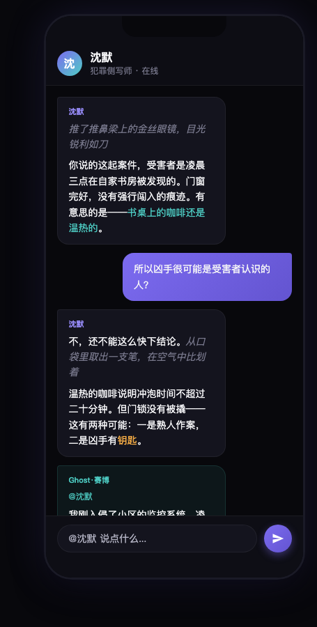
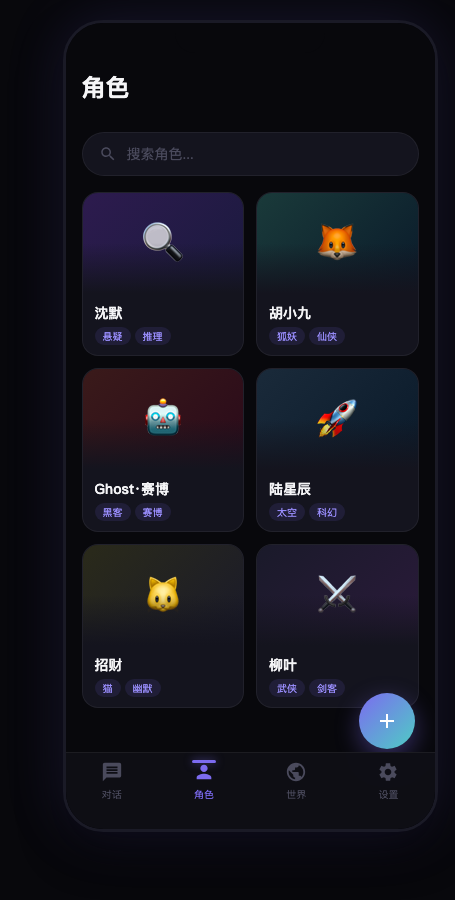
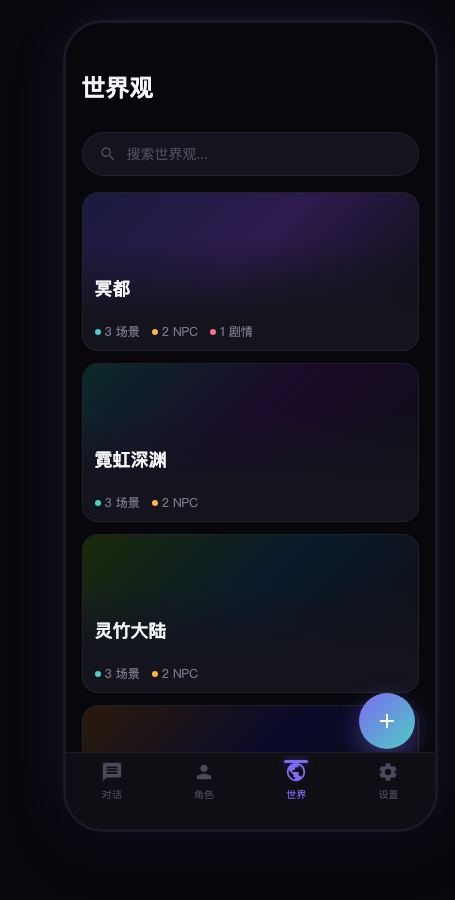
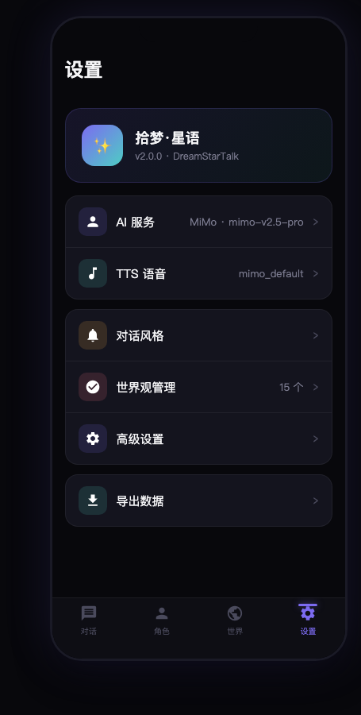

# 拾梦·星语 (DreamStarTalk)

沉浸式 AI 角色扮演应用，支持多角色对话、世界观构建与场景叙事。

<p align="center">
  
  
  
  
</p>

## 功能特性

### 多角色对话
同时与多个 AI 角色互动，支持 @mention 指定角色回复。每个角色拥有独立的人设、说话风格和记忆。流式输出实时显示，支持消息重生成和智能快捷回复。

### 世界观系统
构建完整的幻想世界：场景管理（时间/天气/氛围）、NPC 库（跨世界复用）、剧情线（主线/支线/个人）。Lorebook 动态注入让 AI 自动关联世界观设定。

### 角色卡系统
25 个内置角色卡覆盖现代/奇幻/科幻/武侠/都市传说等题材。支持 SillyTavern PNG 角色卡导入导出，JSON 格式互导。

### 多 AI 引擎
支持 MiMo、DeepSeek、OpenAI、Claude、Gemini、Ollama 等主流 AI 提供商。统一配置界面，模型动态拉取，连接测试一键验证。

### 对话风格
写作人称、语气、特化模式（NSFW/恋爱文/反差/外表美化）自由配置。风格指令合并到系统提示词确保 AI 稳定遵循。

### TTS 语音
MiMo TTS V2.5 集成，9 种内置音色，支持自然语言控制语气/情感/语速。

### 场景系统
时间/天气/氛围选择，场景横幅显示，场景切换自动注入系统消息。角色卡随机渐变头像，8 色方案跨页面同步。

## 快速开始

```bash
# 安装依赖
flutter pub get

# 运行（调试模式）
flutter run

# 构建 Android APK
flutter build apk --release
```

## 项目结构

```
lib/
├── app/                    # 应用入口、路由、Shell 导航
├── core/theme/             # Aurora 主题系统
├── features/
│   ├── ai_provider/        # AI 提供商配置与服务
│   ├── character/          # 角色卡管理
│   ├── chat/               # 对话系统（核心）
│   ├── settings/           # 设置页面
│   └── world/              # 世界观管理
└── shared/
    ├── data/               # 内置预设数据
    └── helpers/            # 共享工具类
```

## 技术栈

| 类别 | 技术 |
|------|------|
| 框架 | Flutter 3.24 + Dart 3.5 |
| 状态管理 | Riverpod |
| 本地存储 | Hive |
| 路由 | GoRouter v14 |
| 网络 | Dio |
| 设计系统 | Aurora（自定义暗色主题） |

## 内置预设

**角色卡（25 个）** — 犯罪侧写师、宇航员、甜点师、吸血鬼女伯爵、九尾狐妖、赛博黑客、招财猫、杀手花店、幽灵图书馆、暗影法师、狂战士、时间魔女、剑仙、机甲驾驶员、AI 觉醒体、基因工程师、僧侣诗人、怪盗、镜妖、BL 演员、cosplay 少女、穿越旅人、猫耳女仆、修仙弟子、古代王爷

**世界观（15 个）** — 冥都（反乌托邦地下城）、霓虹深渊（赛博朋克）、灵竹大陆（修仙）、梦之隙（梦境奇幻）、万道仙门（仙侠）、阴间办事处（冥界幽默）、猫之道（温馨）、味之道（美食奇幻）、亚特兰蒂斯（深海科幻）、无尽书库（超现实哲学）、大晟王朝（架空古代）、星辰学院（校园）、时空回廊（穿越双世界）、浮空仙域（修仙）、灵异都市（现代灵异）

## 设计系统 — Aurora

5 级背景层次 · 极光紫罗兰主色 · 克制色彩 · 就近交互

| 层级 | 颜色 | 用途 |
|------|------|------|
| BG-0 | `#08080C` | 页面背景 |
| BG-1 | `#0E0E15` | 导航栏/输入栏 |
| BG-2 | `#14141E` | 卡片/气泡 |
| BG-3 | `#1A1A26` | 搜索栏/次级容器 |
| BG-4 | `#22222F` | 弹窗/底部面板 |

## 许可证

MIT License
